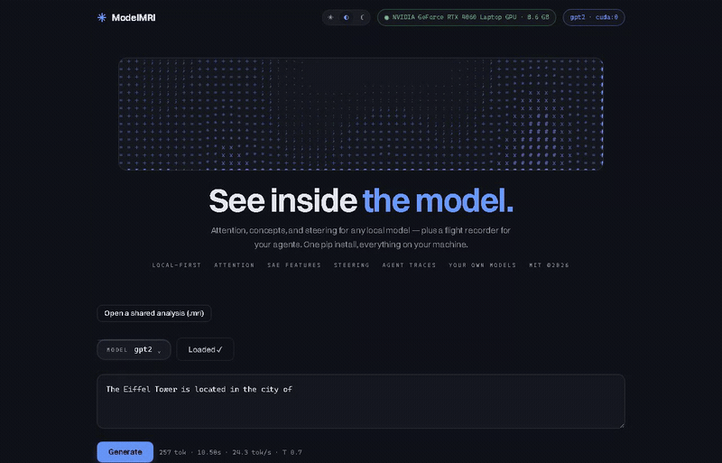
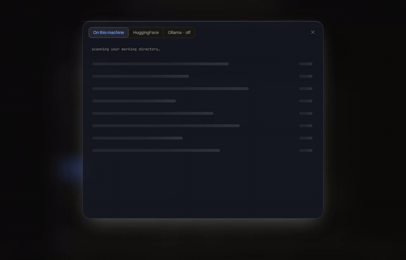
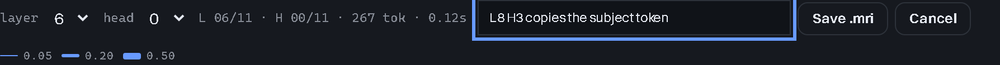
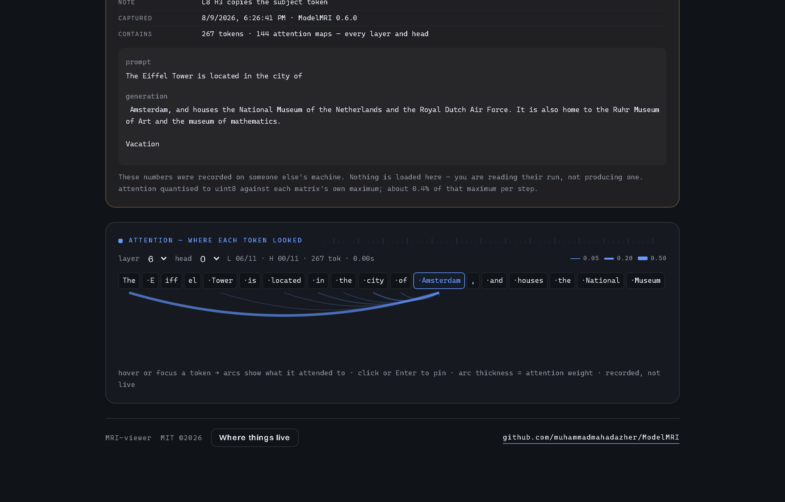

<h1 align="center">ModelMRI</h1>

<p align="center"><strong>Chrome DevTools for AI models and agents.</strong></p>

<p align="center">
  <a href="https://pypi.org/project/modelmri/"></a>
  <a href="https://pypi.org/project/modelmri/"></a>
  <a href="https://pypi.org/project/modelmri/"></a>
  <a href="https://github.com/muhammadmahadazher/ModelMRI/actions/workflows/ci.yml"></a>
  <a href="LICENSE"></a>
</p>

<p align="center">
  <a href="https://muhammadmahadazher.github.io/ModelMRI/"><b>▶ Live demo</b></a> ·
  <a href="https://muhammadmahadazher.github.io/ModelMRI/viewer/"><b>Open a .mri</b></a> ·
  <a href="https://muhammadmahadazher.github.io/ModelMRI/docs/"><b>Docs</b></a> ·
  <a href="https://modelmri.substack.com"><b>Build log</b></a>
</p>

Load any local model — LLM, VLM, or robot policy — and see inside it while it runs: what it attended to, which concepts fired, what happens when you turn one off, and exactly where your agent went wrong.

Local-first. No cloud, no account, no telemetry. MIT.

<p align="center">
  
</p>

<p align="center"><em>Hover any token — arcs show what it attended to. Every layer, every head.</em></p>

```bash
pip install modelmri
modelmri serve          # open http://localhost:5900
```

<p align="center">
  
</p>

<p align="center"><em>It finds the models you already have — HF cache, plain folders, GGUF — before asking you to type anything.</em></p>

---

## What you can actually do with it

### 1. See what a token attended to

Type a prompt, watch it stream, then hover any token — arcs show which earlier tokens it looked at, scaled by attention weight, for any layer and head.

> On GPT-2, the generated token `" Paris"` attends back to `" capital"` and `" France"`. The information was always there. Nobody was looking.

### 2. Find a concept and turn it off

Load a sparse autoencoder and ModelMRI shows the human-interpretable features firing on every token. Click one, drag the slider, and run a deterministic A/B:

```
prompt   The Eiffel Tower is located in the city of
baseline  Paris, France.
feature #974 @ -40   San Diego, and is located in the San Diego State University
```

Same prompt, greedy decoding, no prompt tricks. We reached into layer 8 and turned the concept down. Clearing the steer restores the baseline byte-for-byte.

### 3. Find the step where your agent died

Two lines of `modelmri.record` around any agent run gives you a timeline: LLM calls, tool calls, subagents, each as a block. The failure glows. Click it for the exact input, output, tokens, and error.

```python
from modelmri.record import trace, step

with trace("fix-failing-tests"):
    step("llm_call", name="plan", input=prompt, output=answer, tokens_in=912)
    with step("subagent", name="auth-fixer"):
        step("tool_call", name="pytest", output="17 passed")
```

Or instrument automatically: `modelmri.record.instrument_anthropic()`.

### 4. Look inside a robot policy

This is the part nobody else ships. ModelMRI loads the **vision tower of the real SmolVLA checkpoint** and runs actual robot-camera frames through it, painting each image patch's attention back onto the frame. Scrub an episode, run the policy, drag the layer slider.

Measured on PushT frames — share of attention mass in the top 5% of patches:

| vision layer | concentration |
|---|---|
| 0 | 27% |
| 6 | 56% |
| 11 | 60% |

Early layers look everywhere; deep layers lock on. No robot hardware required — it reads public LeRobot datasets straight from disk.

### 5. Debug a model you trained yourself

Everything above is transformer-shaped. This isn't. Point ModelMRI at your own `nn.Module` — an MLP, a small CNN, whatever you're training — and get a layer-by-layer map of one real forward pass.

```python
# my_net_adapter.py — the whole contract
def load():
    model = MyNet()
    model.load_state_dict(torch.load("checkpoints/best.pt", map_location="cpu"))
    return model
```

| layer | type | output | activation | |
|---|---|---|---|---|
| `fc1` | Linear | 8×64 | −31.20 ± 24.21 | |
| `act1` | ReLU | 8×64 | 0.10 ± 0.26 | **80% dead** |
| `fc2` | Linear | 8×32 | −1.02 ± 4.74 | |
| `act2` | Tanh | 8×32 | −0.12 ± 0.90 | **55% saturated** |
| `head` | Linear | 8×3 | −0.13 ± 0.44 | |

Dead units, saturated activations, and **the first layer where a `nan` appears** — statistics exclude non-finite values on purpose, so one bad number can't turn every row below it into `nan` and hide where it started.

A `state_dict` alone is refused, with the reason: it's weights without an architecture, and guessing one would produce a map that looks authoritative and describes a network you never trained.

### 6. Send someone the finding, not the model

You found the head. Now show a colleague — who does not have your GPU, your prompt, or 8 GB of spare disk.

<p align="center">
  
</p>

That writes **one 54 KB file** holding the tokens, the attention, the generation and your note. No weights — it's an observation, not a checkpoint.

<p align="center">
  
</p>

<p align="center"><em>The recipient opens it at <a href="https://muhammadmahadazher.github.io/ModelMRI/viewer/">the viewer</a> — nothing installed, nothing uploaded, the file is read in their browser. Or <code>modelmri open gpt2.mri</code> if they have it locally.</em></p>

Every panel reads a recording through the same calls it uses for a live model, so the arcs, the layer/head dials and the token strip all behave normally. The status pill says `replay` and the footer says *recorded, not live*, so it can never be mistaken for your own run.

The browser viewer and the Python tool are checked cell-for-cell against the same file on every change ([tests/viewer_check.py](tests/viewer_check.py)) — a viewer that renders a *slightly* different matrix would be worse than no viewer, because nothing on screen would say so.

---

## Install

```bash
pip install modelmri              # core: playground, attention, features, steering, agents
pip install "modelmri[vla-lite]"  # + robot datasets (av, pyarrow, pillow)
pip install modelmri-record       # just the agent recorder — stdlib only, a 9 KiB wheel
modelmri serve
```

From source:

```bash
git clone https://github.com/muhammadmahadazher/ModelMRI && cd ModelMRI
cd frontend && npm ci && npm run build && cd ..
uv sync && uv run modelmri serve
```

**Models.** Search HuggingFace, pick from what's already cached on your machine, or switch to **Ollama** and pull any model by name. (Ollama gives you text only — internals need a HuggingFace model, and ModelMRI says so rather than pretending.)

**Nothing downloads by surprise.** Every row shows its size before you click, and a download that cannot fit your disk is refused with both numbers rather than started. One that dwarfs your GPU asks first. Whatever is running, **Stop** actually stops it — the fetch happens in a child process precisely so it can be killed, and the half-written blobs are cleaned up. This exists because a click once began fetching 1.5 TB onto an 8 GB laptop with no way out but killing the server.

**GPU when you have one.** NVIDIA, AMD, Intel and Apple silicon are detected automatically and the badge explains its choice — including the common case where torch was installed as a CPU-only build, where it prints the exact command to fix it. CPU works fine too; a 0.5B model streams in a couple of seconds.

## API

The UI is a client of a plain HTTP API — script against it directly.

| | |
|---|---|
| `POST /api/model/load` | `{hf_id, source}` — `"hf"` or `"ollama"` |
| `WS /ws/generate` | stream tokens |
| `GET /api/attention` | `?layer=&head=` → tokens + attention matrix |
| `POST /api/sae/load` · `GET /api/features/summary` | SAE features per token |
| `POST /api/steer` | `{feature_id, scale}` — clamp a concept during generation |
| `POST /api/traces/import` · `GET /api/traces/{id}` | agent traces |
| `POST /api/vla/analyse` · `GET /api/vla/attention` | robot-policy attention |
| `POST /api/custom/load` · `POST /api/custom/run` | inspect a model you trained yourself |

## Status

| | |
|---|---|
| Playground · streaming · any local model · Ollama | ✅ |
| Attention inspector | ✅ |
| SAE feature browser + activation steering | ✅ |
| Agent trace timeline + step inspector | ✅ |
| Robot policy (VLA) attention over real episodes | ✅ perception |
| Custom models — adapters, TorchScript, layer map | ✅ |
| Shareable `.mri` sessions + zero-install browser viewer | ✅ |
| Download size guard + a Stop button that works | ✅ |
| VLA action expert (needs `lerobot`, separate env) | 🏗️ |
| Hosted zero-install demo | ✅ |

## Honest limits

- **Attention needs eager attention.** SDPA and FlashAttention never materialize the weights, so ModelMRI loads models with `attn_implementation="eager"`. Slower, but it's the only way to see anything.
- **SAE features need an SAE that exists.** They are trained per model, and public ones cover about a dozen models in total — there is none for most of what you will load, and no amount of code makes one appear. ModelMRI offers the one that matches your model, says plainly when there is none, and falls back to a logit lens, which needs nothing but the model.
- **Custom models get a layer map, not attention.** Attention and SAE features need a transformer; for an arbitrary `nn.Module` ModelMRI shows shapes, activation statistics and pathologies. Loading an adapter runs your Python — see [SECURITY.md](SECURITY.md).
- **VLA mode is the perception half.** SmolVLA's vision tower is real and loaded from the real checkpoint; the action expert needs `lerobot`, whose torch/numpy pins conflict with the core runtime, so it lives behind an opt-in extra rather than degrading everyone's install.

## Contributing

Issues and pull requests are welcome. One rule runs the whole repository:
**don't ship a measurement you haven't verified.** A visualization that looks
plausible and is wrong is worse than none, because interpretability is exactly
the domain where nobody has an independent way to notice.

- [Contributing guide](CONTRIBUTING.md) — setup, quality gates, and the three
  bugs that made that rule
- [Code of conduct](CODE_OF_CONDUCT.md)
- [Security policy](SECURITY.md) — trust model, credential handling, and what
  loading a model actually executes
- [Support](SUPPORT.md) · [Changelog](CHANGELOG.md)

## Built in public

Notes, mistakes, and what broke: [modelmri.substack.com](https://modelmri.substack.com)

MIT © Muhammad Mahad Azher
